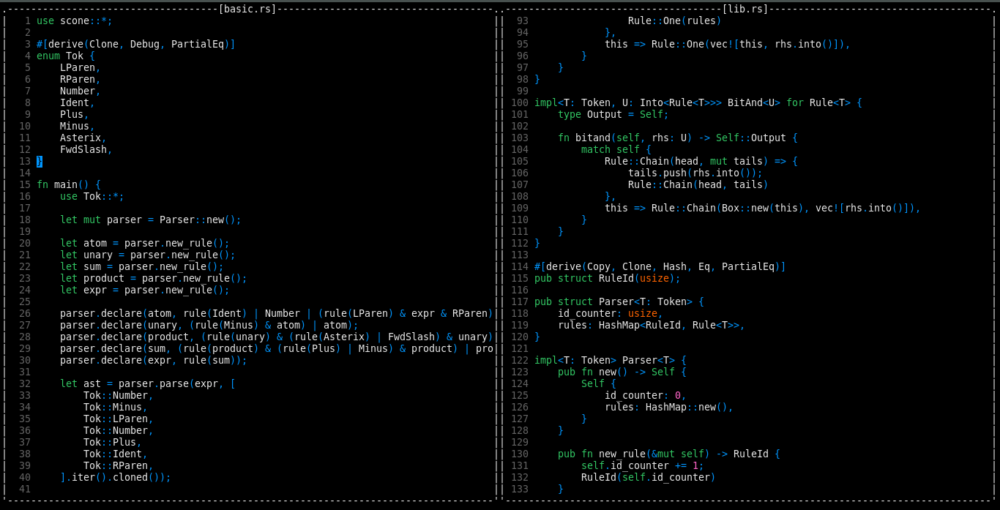

# ZTE

Zesterer's Text Editor

# 

## What

ZTE is a personal project. I grew frustrated with existing text editors and wanted something that worked exactly as I liked. This is not designed to be a general-purpose text editor with lots of fancy bells and whistles - it's supposed to work as I want it to and no more besides.

## Features

- Multi-pane editor
- Clipboard support
- Buffers are independent of editors
- Buffer switching and opening
- Automatic indentation
- Syntax highlighting for
    - `.rs`
    - `.toml`
    - `.glsl`
    - `.ron`
    - `.md`
    - `.log`
