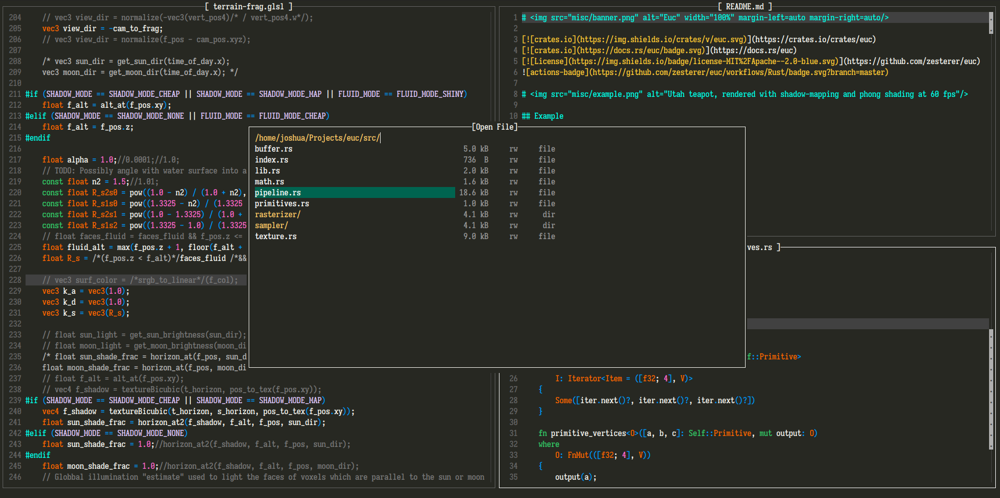

# ZTE

Zesterer's Text Editor

# 

## What

ZTE is a personal project. I grew frustrated with existing text editors and wanted something that worked exactly as I liked. This is not designed to be a general-purpose text editor with lots of fancy bells and whistles - it's supposed to work as I want it to and no more besides.

## Features

- Multi-pane editor
- Clipboard support
- Buffers are independent of editors
- Buffer switching and opening
- Automatic indentation
- Syntax highlighting for
    - `.rs`
    - `.toml`
    - `.glsl`
    - `.ron`
    - `.md`
    - `.log`
    - `.tao`

## Keybindings

### Text manipulation

Within an editor pane, 'standard' non-modal keybindings apply:

- Arrow keys + page up + page down to move around the text
- Control + arrow keys to move around the text word-wise
- Shift + arrow keys to select text

- `Ctrl + X`: Cut
- `Ctrl + C`: Copy
- `Ctrl + V`: Paste
- `Ctrl + D`: Duplicate line or selection

### Editor pane manipulation

- `Alt + W/A/S/D`: Switch to the next editor pane in the given direction
- `Alt + Shift + W/A/S/D`: Create a new editor pane in the given direction
- `Alt + Q`: Close the current editor pane

### Buffer manipulation

- `Ctrl + O`: Open a file in a new buffer (or reuse an existing buffer if the file is already open)
- `Ctrl + S`: Save the current buffer
- `Ctrl + N`: Create a new buffer (currently not useful until saving buffers with new names is implemented, use `Ctrl + O` instead to create a new file)

- `Ctrl + B`: Switch the current editor pane to a new buffer
- `Ctrl + Q`: Close the current buffer (unsaved data will be lost)

### Misc

- `Esc`: Cancel the current action (or close the editor)
